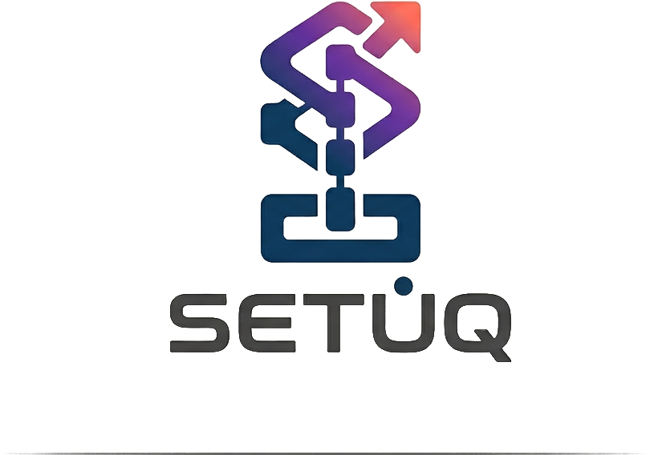
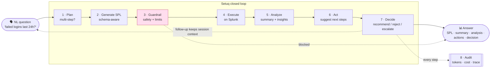
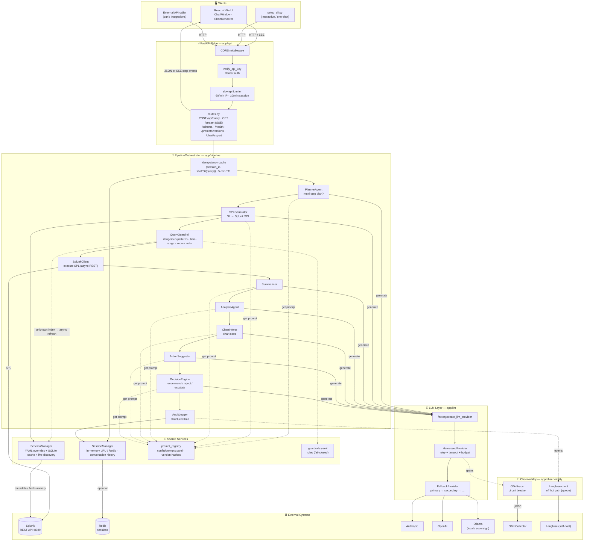
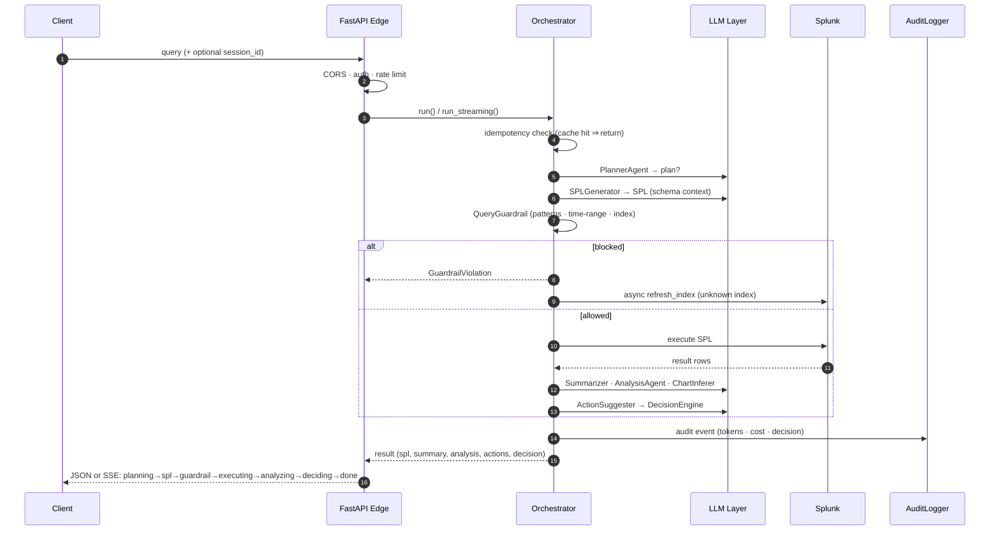

<p align="center">
  
</p>

<h3 align="center">Sovereign, closed-loop SOC agent. Splunk today, every SIEM tomorrow.</h3>

<p align="center"><em>Not query autocomplete — it executes, analyzes, decides, and audits. On-prem if you need it.</em></p>

Agentic AI engine that translates natural-language SOC queries into Splunk SPL, executes them, and returns structured analysis with recommended actions.

<p align="center">
  <a href="LICENSE"></a>
  
  
  
  <a href="https://github.com/setuq-in/setuq/issues"></a>
  <a href="https://github.com/setuq-in/setuq/pulls"></a>
  
</p>

---

## What We're Building — and Why It's Not Just Splunk's AI Assistant

Splunk's AI Assistant for SPL (SAIA) generates SPL from natural language and
explains SPL back. That's where it **stops** — it hands you a query and waits for
human consent before anything runs. Setuq closes the loop SAIA leaves open.

**Our goal: a sovereign, closed-loop SOC agent — not a query autocomplete.**

| | Splunk SAIA / ES | Setuq |
|---|---|---|
| NL → SPL | ✅ mature | ✅ |
| Agentic multi-step plan | ✅ | ✅ |
| **Executes the search** | ❌ stops at "human consent" | ✅ executes |
| **Analyzes results + decides** (recommend / reject / escalate) | Partial (Triage prioritizes) | ✅ explicit decision engine |
| **Autonomous action loop** | Roadmap only (2026) | ✅ now |
| Data egress | ⚠️ cloud-connected, data leaves prem (`*.scs.splunk.com`) | ✅ fully local option (Ollama) |
| LLM choice | Splunk model + Azure OpenAI | ✅ Anthropic / OpenAI / Ollama + fallback chain |
| Guardrails | internal, opaque | ✅ owned, customizable |
| Audit / observability | logs queries | ✅ OTel + Langfuse + prompt-version tracing |
| Platform | Splunk-only | 🎯 Splunk-agnostic (abstract client → Elastic / Sentinel / OpenSearch) |

### Three things Splunk structurally can't or won't do

1. **Sovereign / air-gapped autonomy.** SAIA *requires* outbound HTTPS to Splunk
   Cloud. Regulated, gov, defense, and finance SOCs that cannot egress security
   data are locked out. Setuq runs fully local on Ollama — your data never leaves.
   **Strongest wedge.**

2. **Closed-loop autonomy now.** SAIA stops at "human consent before execute."
   Splunk ES autonomous response is 2026 *roadmap*. We already
   execute → analyze → decide → audit today.

3. **Splunk-agnostic, multi-SIEM.** `SplunkClient` is an abstraction. The same
   pipeline targets Elastic / Sentinel / OpenSearch. Splunk's AI only works on
   Splunk — a moat they literally cannot copy.

> **Where we don't compete:** NL→SPL is a commoditized checkbox feature. So is
> docs-RAG and "Optimize SPL." We don't win there and don't try to. We win on
> **on-prem autonomy + closed loop + multi-SIEM**.

Full strategic comparison: [`docs/competitive-analysis-splunk.md`](docs/competitive-analysis-splunk.md).

---

## How It Works

The following diagram illustrates how a natural-language SOC question flows through
Setuq's closed loop — from question to audited decision, with a human in the loop only
where you want one:



**What each stage does — and where Splunk's assistant stops:**

| Stage | Setuq does | SAIA / ES |
|-------|-----------|-----------|
| **Plan** | Breaks complex asks into sub-queries | ✅ |
| **Generate SPL** | NL → SPL with live schema context | ✅ (commodity) |
| **Guardrail** | Owned, customizable safety + time-range + index checks | opaque |
| **Execute** | **Runs the search** | ❌ stops at consent |
| **Analyze** | Summary + deep analysis + chart spec | partial |
| **Act** | Suggests concrete next steps | roadmap |
| **Decide** | Explicit recommend / reject / escalate | ❌ |
| **Audit** | OTel + Langfuse + prompt-version trace per request | logs only |

Stages 4–8 are the loop Splunk leaves open. The same flow is **Splunk-agnostic** — swap
`SplunkClient` for Elastic / Sentinel / OpenSearch and nothing else changes.

---

## Architecture

Setuq is a FastAPI agentic backend fronted by a React UI and CLI. A request flows
through four layers: **clients → API edge → pipeline orchestrator → LLM + external
systems**. The orchestrator is the brain — it sequences a chain of single-purpose
agents (plan → SPL → guardrail → execute → summarize → analyze → act → decide → audit),
each resolving its prompt from a versioned registry and emitting OTel/Langfuse traces.

### System architecture



### Request lifecycle (`POST /api/query` / SSE)



---

## Features

- **Natural language → SPL**: LLM-powered query generation with schema context
- **Multi-step planning**: Complex queries broken into sub-queries
- **Guardrails**: Pattern-based blocking + time range limits
- **SSE streaming**: Real-time step events via `GET /api/query/stream`
- **Session memory**: Conversation history (in-memory or Redis-backed)
- **LLM fallback chain**: Primary → secondary → ... on failure
- **Prompt versioning**: sha256 hashes tracked per request in OTel spans
- **AI observability**: OpenTelemetry traces + Langfuse self-host v2
- **Rate limiting**: 60/min per-IP + 10/min per-session sliding window
- **Idempotency**: Identical queries within 5-min window return cached result
- **Schema discovery**: Auto-discover indexes/fields from live Splunk
- **Eval harness**: Golden query scoring with optional LLM judge

---

## Running Setuq (end to end)

### 1. Stand up Splunk + data

Setuq needs a reachable Splunk instance with data and a schema it can read. Follow the guides in [`splunkSetUp/`](splunkSetUp/):

1. [`splunk-installation-guide.md`](splunkSetUp/splunk-installation-guide.md) — install Splunk Enterprise locally.
2. [`splunk-add-data-guide.md`](splunkSetUp/splunk-add-data-guide.md) — ingest data into an index.
3. [`splunk-query-dashboard-guide.md`](splunkSetUp/splunk-query-dashboard-guide.md) — verify with SPL + dashboards.

Note the Splunk host, management port (default `8089`), and credentials — the next step asks for them.

### 2. One-command bootstrap (recommended)

From the repo root:

```bash
python bootstrap.py up
```

This runs: env wizard → Splunk connectivity check → metadata extract + `schema_overrides.yaml` build → install engine deps → print the run commands. Re-run flags: `--reconfigure` (re-edit `.env`), `--refresh-schema` (re-extract), `--skip-launch` (setup only).

It writes `engine/.env` (full config) and root `.env` (Splunk keys for the extractor).

### 3. Start the services

The bootstrapper prints these at the end — run each in its own terminal:

```bash
# Engine (FastAPI) — listens on 127.0.0.1:8001
cd engine
uvicorn app.main:app --host 127.0.0.1 --port 8001

# UI (React + Vite) — http://localhost:3000, proxies /api -> :8001
cd ui
npm install        # first run only
npm run dev
```

Open **http://localhost:3000**.

### Manual setup (instead of bootstrap)

```bash
cd engine
python -m venv venv && source venv/bin/activate   # Windows: venv/Scripts/activate
pip install -r requirements.txt
cp .env.example .env   # fill in SPLUNK_HOST/PORT/USERNAME/PASSWORD, LLM_API_KEY, etc.
uvicorn app.main:app --host 127.0.0.1 --port 8001
```

### 4. Use it

- **UI**: http://localhost:3000 — chat interface.
- **CLI**: `python cli/setuq_cli.py "show failed logins in the last 24 hours"` (add `--interactive`, `--health`, `--schema`, or `--url`).
- **API**: `curl -X POST http://127.0.0.1:8001/api/query -H "Content-Type: application/json" -d '{"query": "show failed logins in the last 24 hours"}'`

For a deeper walkthrough (tests, guardrail checks, audit logs), see [`docs/LOCAL_TESTING_GUIDE.md`](docs/LOCAL_TESTING_GUIDE.md).

---

## API Endpoints

| Method | Path | Purpose |
|--------|------|---------|
| `POST` | `/api/query` | Submit query; returns full result |
| `GET` | `/api/query/stream` | SSE stream of step events |
| `GET` | `/api/schema` | Current schema (indexes + fields) |
| `GET` | `/api/health` | Health check |
| `GET` | `/api/prompts/versions` | Prompt version hashes |

### POST `/api/query`

```json
{
  "query": "show failed logins in the last 24 hours",
  "session_id": "optional-uuid"
}
```

Response includes: `spl`, `result_count`, `summary`, `analysis`, `actions`, `decision`, `session_id`.

### GET `/api/query/stream`

Query params: `query=<text>&session_id=<uuid>`

Server-Sent Events stream:

```
data: {"step": "planning", "has_plan": false}
data: {"step": "spl", "spl": "index=auth | ..."}
data: {"step": "guardrail", "passed": true}
data: {"step": "executing", "result_count": 42}
data: {"step": "analyzing", "result_count": 42}
data: {"step": "deciding", "decision": "recommend"}
data: {"step": "done", "result": {...}}
```

---

## Configuration

Set via environment variables (or `.env`):

| Variable | Default | Description |
|----------|---------|-------------|
| `LLM_PROVIDER` | `anthropic` | `anthropic` / `openai` / `ollama` |
| `LLM_API_KEY` | — | API key for LLM provider |
| `LLM_MODEL` | — | Model name |
| `FALLBACK_ENABLED` | `false` | Enable LLM fallback chain |
| `FALLBACK_PROVIDERS` | `""` | Comma-separated fallback provider names |
| `SPLUNK_HOST` | — | Splunk instance URL |
| `SPLUNK_TOKEN` | — | Splunk bearer token |
| `REDIS_URL` | `""` | Redis URL; empty = in-memory sessions |
| `RATE_LIMIT_ENABLED` | `true` | Enable rate limiting |
| `IDEMPOTENCY_CACHE_ENABLED` | `true` | Cache identical queries |
| `IDEMPOTENCY_TTL_SECONDS` | `300` | Idempotency window |
| `SCHEMA_DISCOVERY_ENABLED` | `false` | Live schema discovery from Splunk |
| `SCHEMA_REFRESH_HOURS` | `24.0` | Periodic schema refresh interval |
| `GUARDRAIL_MAX_TIME_RANGE_DAYS` | `90` | Max SPL time range |
| `SESSION_MAX_TURNS` | `10` | Max turns per conversation |
| `OBSERVABILITY_ENABLED` | `false` | OpenTelemetry tracing |
| `OTLP_ENDPOINT` | `""` | OTel collector gRPC endpoint |
| `LANGFUSE_HOST` | `""` | Langfuse self-host URL |
| `LANGFUSE_PUBLIC_KEY` | `""` | Langfuse public key |
| `LANGFUSE_SECRET_KEY` | `""` | Langfuse secret key |
| `API_KEY` | `""` | Bearer auth key; empty = no auth |

---

## Authentication

Set `API_KEY` in env. All requests require:

```
Authorization: Bearer <API_KEY>
```

Leave `API_KEY` empty to disable auth (dev only).

Auto-execute mode (allows pipeline to auto-run recommendations):

```
X-Allow-Auto-Execute: true
```

---

## LLM Providers

Supports `anthropic`, `openai`, `ollama`. All wrapped in `HarnessedProvider` (retry + timeout + budget).

**Fallback chain** (optional):

```env
FALLBACK_ENABLED=true
FALLBACK_PROVIDERS=openai,ollama
```

Primary fails → tries `openai` → tries `ollama` → raises error.

---

## Session Memory

**In-memory** (default): `SessionManager` with LRU cap (1000 sessions), 1-hour TTL.

**Redis-backed**: Set `REDIS_URL=redis://localhost:6379`. Sessions persist across restarts, TTL=1 hour.

---

## Schema Discovery

Disabled by default. Enable to auto-discover indexes and fields from live Splunk:

```env
SCHEMA_DISCOVERY_ENABLED=true
SCHEMA_CACHE_PATH=engine/data/schema_cache.db
SCHEMA_REFRESH_HOURS=24
```

Override/extend schema via `schema_overrides.yaml`.

Reactive refresh: when guardrail detects unknown index, triggers background `refresh_index()`.

---

## Observability

### OpenTelemetry

```env
OBSERVABILITY_ENABLED=true
OTLP_ENDPOINT=http://otel-collector:4317
```

Traces per request with attributes: `session.id`, `query.hash`, `prompt.version.<name>` for each pipeline prompt.

Circuit breaker: after 5 consecutive export failures, OTel is bypassed (no pipeline impact).

### Langfuse (AI Observability)

Bring up a self-hosted Langfuse (+ Postgres) with the bundled compose file:

```bash
docker compose -f docker-compose.observability.yml up -d
```

Langfuse serves on `http://localhost:3000`. Open it, create a project, copy the keys, then set:

```env
LANGFUSE_HOST=http://localhost:3000
LANGFUSE_PUBLIC_KEY=pk-...
LANGFUSE_SECRET_KEY=sk-...
```

> **Port note:** Langfuse uses `3000` — the same port as the UI dev server. Run them on different ports (e.g. map Langfuse to `3001:3000` in the compose file) if you need both at once.

Self-hosted Langfuse v2. All LLM calls traced with cost, latency, token counts.

---

## Running Tests

```bash
cd engine
python3 -m pytest tests/ -q
```

313 tests across 5 sprints. Coverage: pipeline, API, LLM validation, schema, SSE, Redis sessions.

```bash
# Run specific module
python3 -m pytest tests/pipeline/ -q

# Run with verbose output
python3 -m pytest tests/ -v
```

---

## Eval Harness

Golden query evaluation against 10 SOC benchmark queries:

```bash
cd engine
python3 eval/runner.py                     # keyword scoring only
python3 eval/runner.py --sample 3          # random sample of 3
python3 eval/runner.py --judge             # LLM judge (claude-sonnet-4-6)
python3 eval/runner.py --langfuse          # push to Langfuse
```

Exit code 1 if any query scores below threshold.

---

## Tech Stack

Built on a sovereign-friendly, swappable stack — every layer can run on-prem.

**Backend**


**Frontend**


**LLM providers**


**Data & infra**


**Observability**


---

## Contributing

Contributions are welcome — bug reports, SPL guardrail rules, new `SplunkClient`
backends (Elastic / Sentinel / OpenSearch), evals, and docs all help.

**Quick start**

1. **Find or open an issue.** We track work in [GitHub Issues](https://github.com/setuq-in/setuq/issues). Look for [`ready-for-human`](https://github.com/setuq-in/setuq/labels/ready-for-human) or [`good first issue`](https://github.com/setuq-in/setuq/labels/good%20first%20issue) to get started.
2. **Fork & branch.** Branch from `main` using a descriptive name (e.g. `feature/elastic-client`, `fix/guardrail-time-range`).
3. **Set up locally.** Follow [Running Setuq](#running-setuq-end-to-end) — `python bootstrap.py up` gets the engine and UI running.
4. **Make the change.** Keep it surgical and matched to existing style (see [`CLAUDE.md`](CLAUDE.md) working principles). Add prompts/guardrails to their YAML files, not code.
5. **Test it.** `cd engine && python3 -m pytest tests/ -q` must stay green; add tests for new behavior. Run the [eval harness](#eval-harness) if you touch the pipeline.
6. **Open a PR.** Describe the change and link the issue. Keep PRs focused.

**Ground rules**

- Every changed line should trace to the issue you're solving — no drive-by refactors.
- Prompts and guardrails live in `config/*.yaml` (fail-closed, version-hashed) — never hardcode them.
- Be respectful and constructive. By participating you agree to uphold a welcoming, harassment-free community.

> Triage uses a small label vocabulary (`needs-triage`, `needs-info`, `ready-for-agent`, `ready-for-human`, `wontfix`). See [`docs/agents/triage-labels.md`](docs/agents/triage-labels.md).

---

## Community

Setuq is built in the open. Come help shape a sovereign, closed-loop SOC agent.

| | |
|---|---|
| 💬 **Questions & ideas** | [GitHub Discussions](https://github.com/setuq-in/setuq/discussions) |
| 🐛 **Bugs & features** | [GitHub Issues](https://github.com/setuq-in/setuq/issues) |
| 🔒 **Security reports** | Please disclose privately — open a [security advisory](https://github.com/setuq-in/setuq/security/advisories/new) rather than a public issue |
| 📖 **Strategy & docs** | [`docs/competitive-analysis-splunk.md`](docs/competitive-analysis-splunk.md) · [`docs/`](docs/) |

If Setuq is useful to you, the simplest way to help is to **⭐ star the repo** — it
boosts visibility and helps other SOC teams find it.

---

## Sponsors

Setuq is independent, open-source, and on-prem-first. If your organization relies on
sovereign security tooling, sponsorship funds multi-SIEM backends, evals, and
maintenance.

<p align="center">
  <a href="https://github.com/sponsors/setuq-in"></a>
</p>

> _Become the first sponsor — your logo here._ Reach out via [GitHub Issues](https://github.com/setuq-in/setuq/issues) or [Discussions](https://github.com/setuq-in/setuq/discussions) to discuss sponsorship.

---

## License

Licensed under the **[Apache License 2.0](LICENSE)** — free for commercial and private
use, with patent protection. See [`LICENSE`](LICENSE) for the full text.
