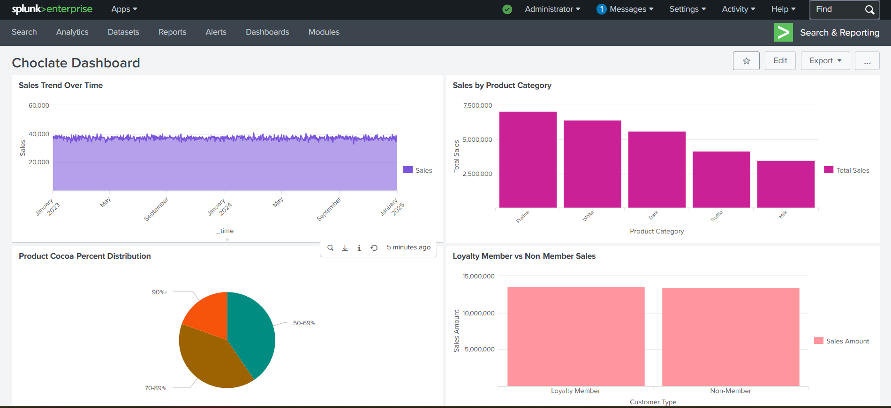
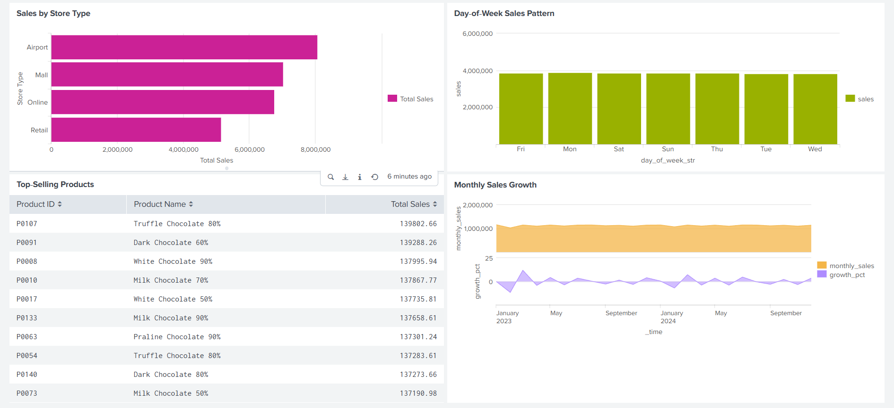

# Running Queries and Creating Dashboards in Splunk

This guide explains how to run SPL (Search Processing Language) queries and create dashboards in Splunk Enterprise, using examples from the provided dashboard.xml file.

## Overview

Splunk's power lies in its ability to search, analyze, and visualize machine data. This guide covers:
1. Running ad-hoc queries in Search & Reporting
2. Saving searches as reports
3. Creating and customizing dashboards
4. Using specific query examples from dashboard.xml

### Dashboard Preview

Here's a glance at how the sample Chocolate Sales Dashboard looks:





## Prerequisites

- Splunk Enterprise installed and running
- Data loaded into indexes (refer to splunk-add-data-guide.md)
- Access to Splunk Web (http://localhost:8000)
- Appropriate permissions (typically power user or admin role)

## Part 1: Running Queries in Search & Reporting

### Step 1: Access Search & Reporting
1. Open your web browser and navigate to `http://localhost:8000`
2. Log in with your credentials
3. From the Splunk Home page, click **"Search & Reporting"** in the left navigation bar

### Step 2: Run a Basic Query
1. In the search bar at the top, enter your SPL query
2. Set the time range using the dropdown next to the search bar (e.g., "Last 24 hours", "All time")
3. Click the **Search** button or press Enter
4. Review results in the:
   - **Events tab**: Raw event data
   - **Patterns tab**: Auto-discovered patterns
   - **Statistics tab**: Tabulated results
   - **Visualization tab**: Charts and graphs

### Step 3: Using Time Modifiers
You can specify time ranges directly in your query:
- `earliest=-24h@h latest=now`: Last 24 hours
- `earliest=-7d@d latest=now`: Last 7 days
- `earliest=0 latest=now`: All time (as seen in dashboard.xml examples)

### Step 4: Saving a Search as a Report
1. After running a successful search, click **"Save As"** above the results
2. Select **"Report"**
3. Provide:
   - Title: Descriptive name for your report
   - Description: Optional details about what the report shows
   - App: Choose where to save it (typically "Search & Reporting")
4. Click **Save**

## Part 2: Creating Dashboards

### Step 1: Create a New Dashboard
1. From Search & Reporting, click **"Dashboards"** in the left navigation
2. Click **"Create New Dashboard"** button
3. Fill in:
   - **Title**: Name for your dashboard (e.g., "Chocolate Sales Analysis")
   - **ID**: Unique identifier (auto-generated from title, can be edited)
   - **Description**: Optional summary of dashboard purpose
   - **Permissions**: Set who can view/edit (Private, Shared in App, Shared Globally)
4. Click **Create**

### Step 2: Add Panels to Your Dashboard
1. On your new dashboard, click **"Edit"** (top right)
2. Click **"Add Panel"** → **"Create New Panel"**
3. This opens a search interface where you can:
   - Enter your SPL query
   - Choose visualization type
   - Configure panel options
4. Alternatively, click **"Add Panel"** → **"Clone Existing Panel"** to copy from another dashboard

### Step 3: Configure Panel Visualizations
When creating/editng a panel:
1. **Enter your SPL query** in the search bar
2. **Select visualization type** from the Visualization tab:
   - **Area Chart**: Good for trends over time (used in dashboard.xml for Sales Trend)
   - **Column Chart**: Vertical bars for comparisons (used for Sales by Category, Day-of-Week)
   - **Bar Chart**: Horizontal bars (used for Sales by Store Type)
   - **Pie Chart**: Shows parts of a whole (used for Cocoa Percentage Distribution)
   - **Table**: Displays raw data in rows/columns (used for Top-Selling Products)
   - **Line Chart**: Similar to area but without fill
   - **Scatter Plot**: Shows relationships between two variables
3. **Configure options** using the Format panel (paintbrush icon):
   - Axis labels, titles, legends
   - Colors, styles, drilldown behavior
   - Specific options like `charting.chart`, `charting.stackMode`, etc.

## Part 3: Using Queries from dashboard.xml

Let's examine and explain the specific queries found in the provided dashboard.xml file:

### Example 1: Sales Trend Over Time (Area Chart)
**Query from dashboard.xml (lines 8-13):**
```
index=chocolate_index sourcetype=sales
| eval _time = strptime(order_date, "%Y-%m-%d")
| eval sales_amount = quantity * unit_price
| bin _time span=1d
| stats sum(sales_amount) as daily_sales by _time
| timechart span=1d sum(daily_sales) as Sales
```

**How to use this query:**
1. Copy the entire query above
2. Paste into Search & Reporting search bar
3. Set time range (e.g., "Last 30 days" or "All time")
4. Click Search
5. You should see an area chart showing daily sales trends
6. To save as a panel: Click "Save As" → "Dashboard Panel" → Select or create dashboard

**What this query does:**
- Filters sales data from chocolate_index
- Converts order_date string to timestamp (_time)
- Calculates sales_amount (quantity × unit_price)
- Groups data into 1-day bins
- Sums sales_amount per day
- Creates timechart visualization

### Example 2: Sales by Product Category (Column Chart)
**Query from dashboard.xml (lines 55-64):**
```
index=chocolate_index sourcetype=sales
| join product_id [
    search index=chocolate_index sourcetype=products
    | fields product_id, category
]
| eval sales_amount = quantity * unit_price
| stats sum(sales_amount) as total_sales by category
| sort - total_sales
| rename category as "Product Category", total_sales as "Total Sales"
```

**How to use this query:**
1. Follow same steps as above
2. This query joins sales data with product information
3. Results show total sales per product category, sorted highest to lowest

**What this query does:**
- Gets sales data
- Joins with product data to get category names
- Calculates sales per line item
- Aggregates by category
- Sorts results descending
- Renames fields for display clarity

### Example 3: Product Cocoa‑Percent Distribution (Pie Chart)
**Query from dashboard.xml (lines 109-117):**
```
index=chocolate_index sourcetype=products
| eval cocoa_bucket = case(
    cocoa_percent < 50, "<50%",
    cocoa_percent >=50 AND cocoa_percent <70, "50-69%",
    cocoa_percent >=70 AND cocoa_percent <90, "70-89%",
    cocoa_percent >=90, "90%+"
)
| stats count by cocoa_bucket
| rename cocoa_bucket as "Cocoa Percentage", count as "Product Count"
```

**How to use this query:**
- Analyzes product data to show distribution of cocoa percentages
- Creates buckets for different cocoa percentage ranges
- Counts products in each bucket
- Ideal for pie chart visualization

### Example 4: Loyalty Member vs Non‑Member Sales (Stacked Column)
**Query from dashboard.xml (lines 129-138):**
```
index=chocolate_index sourcetype=sales
| join customer_id [
    search index=chocolate_index sourcetype=customers
    | fields customer_id, loyalty_member
]
| eval sales_amount = quantity * unit_price
| eval loyalty_flag = if(loyalty_member=1, "Loyalty Member", "Non‑Member")
| stats sum(sales_amount) as sales by loyalty_flag
| rename loyalty_flag as "Customer Type", sales as "Sales Amount"
```

**What this query does:**
- Combines sales and customer data
- Flags customers as loyalty members or not
- Calculates total sales by customer type
- Perfect for stacked column chart showing comparison

### Example 5: Monthly Sales Growth (Area Chart with Split Series)
**Query from dashboard.xml (lines 227-239):**
```
index=chocolate_index sourcetype=sales
| eval sales_amount = quantity * unit_price
| eval _time = strptime(order_date, "%Y-%m-%d")
| bin _time span=1mon
| stats sum(sales_amount) as monthly_sales by _time
| streamstats window=1 current=false sum(monthly_sales) as prev_monthly_sales
| eval growth_pct = if(
    isnull(prev_monthly_sales) OR prev_monthly_sales==0,
    null(),
    round((monthly_sales - prev_monthly_sales) / prev_monthly_sales * 100, 2)
)
| fields _time, monthly_sales, growth_pct
| rename _time as Month, monthly_sales as Sales
```

**What this query does:**
- Calculates monthly sales totals
- Computes month-over-month growth percentage
- Shows both actual sales and growth rate
- Uses `streamstats` to access previous month's value
- Format options in dashboard.xml allow independent Y-ranges for dual-axis effect

## Part 4: Best Practices for Dashboard Creation

### Query Optimization
1. **Start broad, then filter**: Use `index=` and `sourcetype=` early in your query
2. **Filter before calculating**: Apply `where`, `search`, or `filter` commands before complex `eval` or `stats`
3. **Limit results**: Use `head` or `tail` when you only need top/bottom results
4. **Use tstats for accelerated models**: When working with data models for faster aggregation

### Dashboard Design Principles
1. **Purpose first**: Each dashboard should answer specific business questions
2. **Logical flow**: Arrange panels to tell a story (summary → details → root cause)
3. **Consistent time ranges**: Use time inputs to let users change time range for all panels
4. **Appropriate visualizations**: Match chart type to data:
   - Trends over time → Line/Area charts
   - Comparisons → Bar/Column charts
   - Parts of whole → Pie charts
   - Exact values → Tables
5. **Clear labeling**: Use descriptive titles, axis labels, and legends
6. **Avoid clutter**: Limit panels per dashboard (6-8 is usually optimal)

### Adding Interactivity
1. **Drilldowns**: Configure panels to pass values to other dashboards or searches
2. **Inputs**: Add dropdowns, text boxes, or time pickers at dashboard top
3. **Tokens**: Use `$token_name$` syntax to create dynamic queries based on user input
4. **Set tokens on click**: Make panels interactive by setting tokens when clicked

### Example: Adding a Time Range Input
1. In dashboard edit mode, click "Add Input" → "Time"
2. Configure:
   - Label: "Select Time Range"
   - Token name: `time_range`
   - Default: "Last 24 hours"
3. In each panel query, add: `earliest=$time_range.earliest$ latest=$time_range.latest$`

## Part 5: Troubleshooting Common Issues

### Query Doesn't Return Expected Results
1. **Check index and sourcetype**: Verify you're querying the right location
2. **Inspect raw data**: Run `| head` to see actual field names and values
3. **Verify time format**: Ensure `_time` extraction is working correctly
4. **Check for nulls**: Use `isnull()` or `fillnull` if needed
5. **Test incrementally**: Run parts of your query with `| head` to see intermediate results

### Panel Not Displaying Correctly
1. **Visualization mismatch**: Ensure your results match the chart type (e.g., pie charts need one numeric and one categorical field)
2. **Missing fields**: Confirm all referenced fields exist in your results
3. **Format options**: Check if specific XML options (like `charting.chart`) are needed
4. **Permissions**: Verify you have access to all indexes/sourcetypes used

### Dashboard Performance Issues
1. **Reduce time range**: Large time ranges process more data
2. **Optimize queries**: Follow optimization tips above
3. **Use report acceleration**: For frequently run complex searches
4. **Limit concurrent searches**: Avoid overly complex real-time searches

## Part 6: Saving and Sharing Your Work

### Saving Dashboards
1. Dashboards save automatically as you edit
2. To save a copy: Click "Save As" → "Dashboard"
3. To export: In dashboard view, click "Export" → "Export Dashboard"

### Sharing Options
1. **Permissions**: Set during creation or edit via "Edit > Permissions"
2. **Scheduled PDF delivery**: Schedule dashboards to be emailed regularly
3. **Embedding**: Use iframe code to embed in internal websites
4. **Permissions matrix**: Control who can view, edit, change permissions

## References

- **SPL Reference**: https://docs.splunk.com/Documentation/Splunk/latest/SearchReference/SearchReference
- **Dashboard Documentation**: https://docs.splunk.com/Documentation/Splunk/latest/Viz/PanelreferenceforSimplifiedXML
- **Visualization Reference**: https://docs.splunk.com/Documentation/Splunk/latest/Viz/Chartcontrols
- **Examples App**: Install from Splunkbase for more dashboard examples

---
*Guide created for Setuq project*
*Queries referenced from @splunkSetUp/sample-data-dashboard/dashboard.xml*
*Last updated: March 2026*